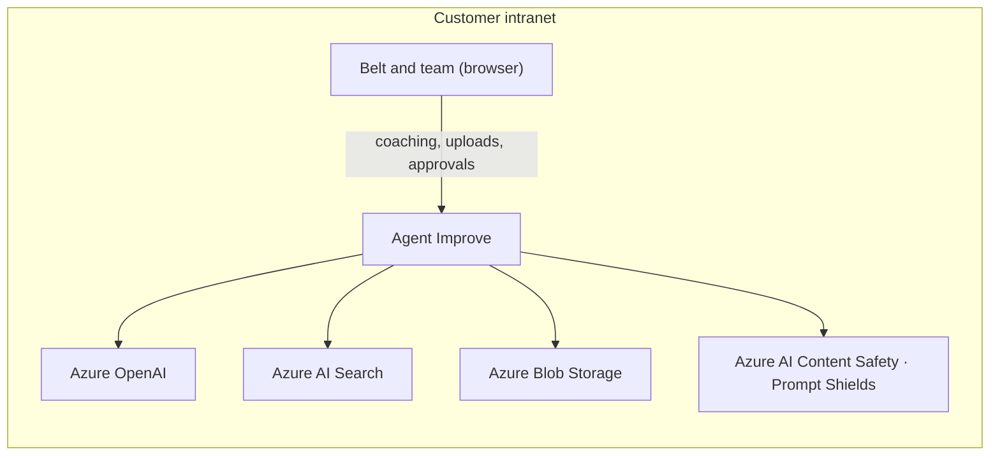
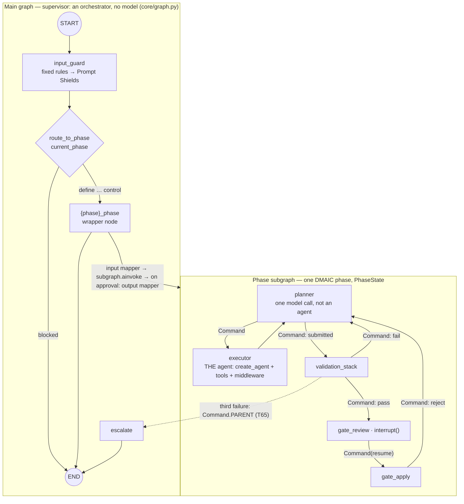
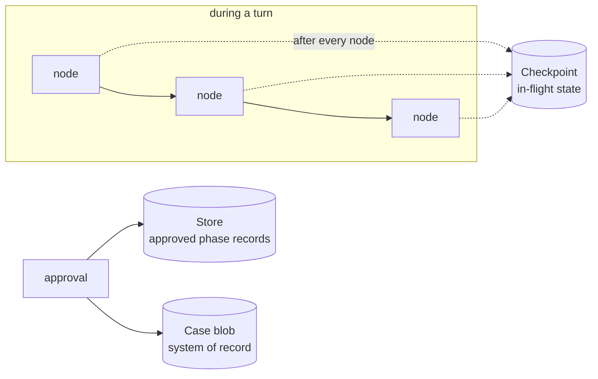
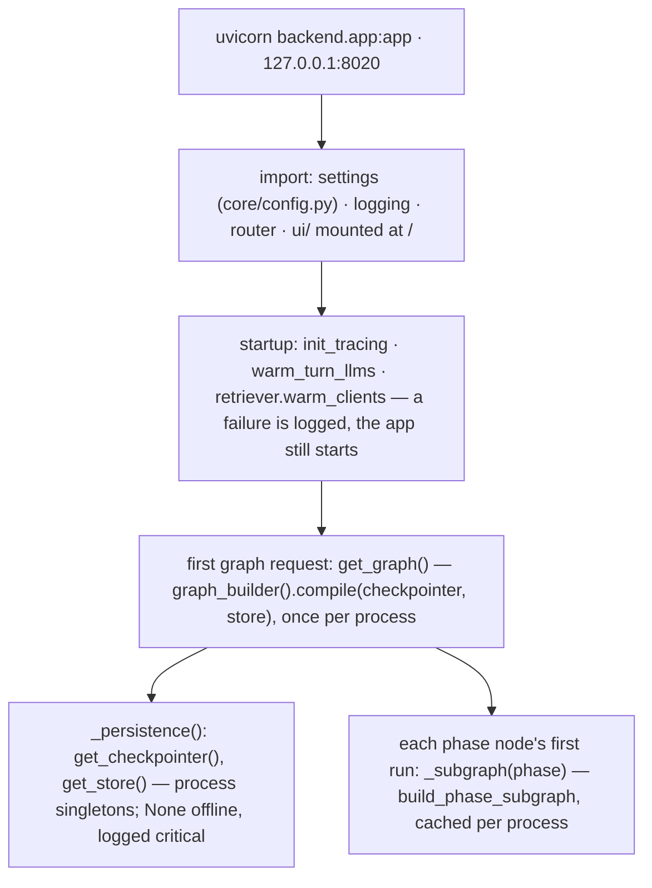
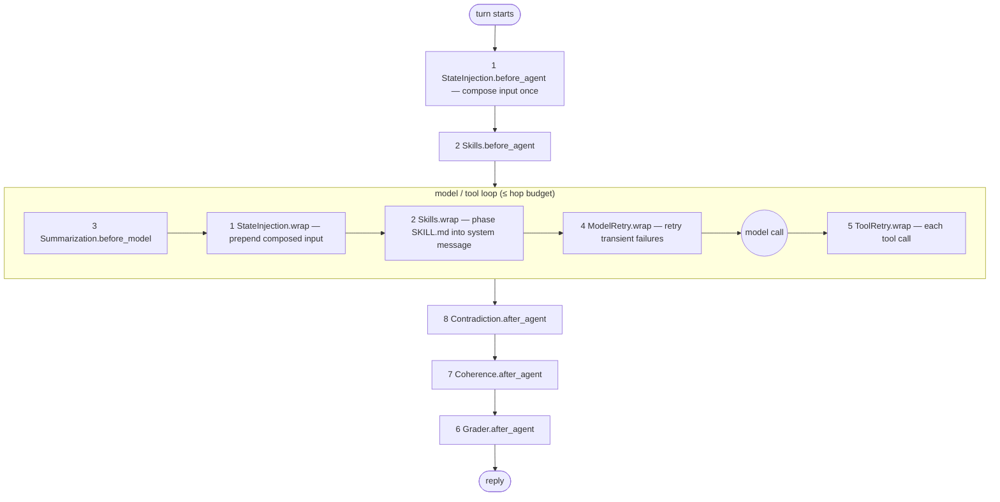

# Agent Improve — Architecture

Version 2.0 (draft for ratification) · 2026-09-27

How Agent Improve is built: its parts, their interfaces, its data models, how errors are handled
and how it is tested. Nothing else lives here.

Elsewhere: requirements `docs/requirements/{business,platform}.md`; what is built and next
`docs/define_features.json`, `docs/test-results.json`; defects `docs/defects.json`; why
`docs/adr/` (ADR-nnnn); method `skills/`; repo rules `CLAUDE.md`, `.claude/`; history git,
`docs/_archive/`.

**Conventions.** Paths are relative to `agent-improve/backend/` unless they start with `ui/`,
`skills/`, `docs/`, `scripts/` or `tools/`. A symbol is written `path::symbol`. §4.2 is
generated from the code on every commit, never edited by hand.
This file changes in the same commit as the code it describes.

---

## 1. Overview

Agent Improve coaches a Lean Six Sigma Belt and their team through a DMAIC project (Define,
Measure, Analyse, Improve, Control). A project runs for weeks; each phase ends at a gate the team
approves. The coach teaches and challenges; it never fills in the Belt's answers. The only data
entering from outside is what the Belt uploads. The system runs inside the customer's intranet.

| Idea | Decision |
|---|---|
| One compiled graph is the only runtime path; routes never dispatch nodes | ADR-0021 |
| Each turn enters that graph at the case's current phase through a deterministic router; approval advances the phase inside the graph | ADR-0063 |
| Every Belt message and every upload is screened before a model reads it: fixed rules, then Prompt Shields, fail closed; a block is answered in code | ADR-0057, ADR-0067 |
| Two levels of state: case routing, and one turn in one phase | ADR-0015 |
| Cross-phase data goes through the Store, never through parent state | ADR-0019 |
| Checkpointer and store attach to the parent graph only; one thread per case | ADR-0017, ADR-0024 |
| The coaching move is decided in code; the model writes the words and makes one sufficiency judgment | ADR-0001, ADR-0025 |
| The coach is `create_agent` with middleware | ADR-0026, ADR-0027 |
| Nothing is stored until the Belt confirms it | ADR-0002 |
| The gate is a graph-level human pause | ADR-0008, ADR-0037, ADR-0038 |
| Captured values are strings | ADR-0016 |
| No MCP; uploads are the only data channel | ADR-0034 |

## 2. Architecture

### 2.1 Context



### 2.2 Containers

```mermaid
flowchart TB
  ui["Browser UI · ui/index.html"]
  api["API · FastAPI · gateway/routes.py"]
  graph["Graph runtime · LangGraph · core/graph.py, phases/"]
  up["Upload pipeline · upload/"]
  ckpt[("Checkpoints · Blob checkpoints/")]
  store[("Store · Blob store/projects/")]
  cases[("Case records, registry, uploads · Blob cases/, registry.json, uploads/")]
  kidx[("improve_knowledge_index_v3")]
  eidx[("improve_evidence_index")]
  cidx[("improve_case_index")]
  llm["Azure OpenAI · premium and operational deployments"]
  ui --> api --> graph
  api --> up --> cases
  up --> eidx
  api --> cases
  graph --> ckpt
  graph --> store
  graph --> llm
  graph --> kidx
  graph --> eidx
  graph --> cidx
```

### 2.3 The graph



- **Main graph** (`core/graph.py::graph_builder`, the one builder, ADR-0063), edges as drawn;
  `input_guard` is ADR-0057. `route_to_phase` makes no model call. There are no phase-to-phase edges; a turn ends after its one phase.
  `get_graph()` compiles the builder once per process with the checkpointer and store; every route
  and test uses it.
- **Wrapper node** (`phase_node`): input mapper (worker thread) → `await subgraph.ainvoke(child)`,
  config inherited through the run context → on `final` (approval) the output mapper (§3.2); the
  next turn enters the next phase. Never from inside a tool.
- **Phase subgraph** (`phases/{phase}/graph.py`; nodes in `phases/nodes_common.py`): exactly five
  nodes; all runtime routing is `Command`; a node never mixes `Command` with a static edge.
- Subgraphs compile with neither checkpointer nor store and write through the parent's saver
  under their own `checkpoint_ns`.
- `thread_id` = case id (`IMPR-YYYY-XXX`, three characters of a UUID, assigned by `gateway/routes.py::create_case`): also the Store namespace segment, the case blob name
  and the `case_id` search filter. `recursion_limit` 50 on the turn graph's invocation is a
  backstop only.

### 2.4 One coaching turn

```mermaid
sequenceDiagram
  participant UI
  participant API as POST /ask
  participant PL as planner
  participant EX as executor
  UI->>API: message, or action confirm / change
  API->>API: get_graph().ainvoke(state, thread_id = case id)
  Note over API: input_guard screens the message; route_to_phase enters current_phase's wrapper node
  API->>PL: the wrapper node's input mapper → subgraph
  PL->>PL: one sufficiency judgment (planner role)
  PL->>PL: moves.decide → teach · challenge · read back · store and advance
  PL->>EX: Command(goto="executor")
  EX->>EX: middleware in → model → tools (≤ hop budget) → middleware out
  EX-->>API: CoachingResponse
  API-->>UI: AskResponse (reply, four blocks, progress, warning)
```

1. A field's status runs not taught → asked → answered → confirmed; only code changes it, at the
   end of a turn. The current field is the first one not confirmed.
2. The move follows the status: teach (explain, sample, ask), challenge (name the failed
   criterion), read back ("is this right?"), store and advance. What was stored, or that a
   Confirm stored nothing, is said by code from the store result (`_store_truth`), never the model.
3. The planner's model returns one `SufficiencyJudgment` against the element's acceptance
   criteria, read from its SKILL.md block — except a target in the baseline's unit, judged in code
   (`define/parse.py::parse_limit`). The SIPOC is stored only with its six columns.
4. `AskRequest.action` = `confirm` stores the pending value; `change` returns the field to asked
   and answers in code without a model call. A later read-back of the element keeps the parts it
   carried before; any the new one lacks are shown under it, in code, and stored only on confirm.
5. For an unread upload the executor node calls `load_evidence_series` before the model runs.
6. The executor counts `rag_lookup_*` calls and answers instead of searching at
   `COACH_HOP_BUDGET` (`phases/nodes_common.py`).
7. The move record and quality feedback travel in the reply's `additional_kwargs`, round-tripped
   by `core/conversation.py`, never as messages. Define's progress label comes from
   `define_progress`.

**Route → graph** (`gateway/routes.py`). Every graph run goes through `_run_turn`: `graph.ainvoke`
as a task raced against `_until_disconnect`; a client gone first cancels it (499).

| Route | Graph input | Config (`_graph_config`) | After the run |
|---|---|---|---|
| `POST /ask` | `_graph_input`: no checkpoint yet → the seven `SupervisorState` fields plus the case's prior conversation; else `{"messages": [new]}`; a checkpoint phase ≠ case phase is 409 | `thread_id` = case id, `entry`, `current_user`, `case_metadata`, `v1_phase_inputs` (every phase's `structured`), `belt_action`; `recursion_limit` 50 | `_mirror_asks` (Store); no blob write — the reply carries the phase's merged record into the checkpoint (ADR-0066) |
| `POST /gate` | the same, `entry="gate"` | same | non-Define phases: `write_phase_gate` on a pass |
| `POST /gate/decision` | `Command(resume={decision, elements, reason, actor, at})` after `_pending_interrupts` finds `accept_define_report` | same, `entry="decision"`; reject sets `belt_action="rejected"` | approve: `assemble_gate_document`, `write_phase_gate` |
| `GET /gate/review/{case_id}/{phase}` | none — `graph.aget_state(config)` reads the pause | same | — |

### 2.5 Checkpoints and persistence

Three stores, three jobs. They are never used for each other's job.



| | Checkpointer | Store | Case blob |
|---|---|---|---|
| Holds | The whole graph state of the case: `SupervisorState` and each subgraph's `PhaseState` under its `checkpoint_ns` | Approved phase records, the case record, cross-phase audit | Case, phase records, upload records, registry |
| Scope | One thread per case (`thread_id` = case id) | Across phases and threads | The case |
| Written | Automatically after every node | Explicitly by key; a put overwrites, so a replay leaves one value | At case creation, upload and approval (once) — never mid-conversation (ADR-0066) |
| Read by | LangGraph; the input mappers and a reload (`routes._with_unfinished_work`), for unfinished work | Input mappers; the state-injection middleware; the grader's reference lookups | Routes (metadata, uploads, approved records), the registry |
| Code | `core/checkpointer.py::AzureBlobCheckpointSaver` | `core/store.py::AzureBlobStore` | `storage/blob.py` (module functions: `create_case`, `load_case`, `save_case`, `write_phase_gate`, `upload_file`) |
| Attached | `graph.compile(checkpointer=…)` on the parent graph only | `graph.compile(store=…)` on the parent graph only; nodes receive it as a parameter | Called by routes, never by the graph |

**How a checkpoint is written.**
- One blob per checkpoint: `checkpoints/{case_id}/latest.json` plus `history/{checkpoint_id}.json`;
  the body's fields are `core/checkpointer.py`'s.
- Writes are conditional on the blob's ETag (§5); never a silent overwrite.
- `put_writes` persists pending writes, so a paused run resumes in another process and writes once.
- A subgraph's state is saved under its own `checkpoint_ns` inside the case's thread (§2.3), so an
  `interrupt()` inside a subgraph is saved and resumed like any other.
- History blobs are kept, so earlier checkpoints can be read (time travel). Rolling back a
  checkpoint does not roll back Store, Blob or index writes.

### 2.6 Human in the loop

There are two points where the graph waits for a person. Both use LangGraph's graph-level
`interrupt()` and resume with `Command(resume=…)` on the same `thread_id`.
`HumanInTheLoopMiddleware` is not used (ADR-0037).

**1 — The gate.**

```mermaid
sequenceDiagram
  participant UI
  participant API
  participant V as validation_stack
  participant R as gate_review
  participant A as gate_apply
  UI->>API: POST /gate
  API->>V: get_graph().ainvoke(submission) → route_to_phase → the phase subgraph
  V->>V: 2b presence → 2d rubric (Define; 2c not built)
  alt a criterion fails
    V-->>UI: criterion named; back to the planner; nothing paused
  else passes
    V->>R: Command(goto="gate_review")
    R-->>API: interrupt(payload) — checkpoint and pending writes saved, nothing else written
    API-->>UI: awaiting acceptance
    UI->>API: GET /gate/review/{case_id}/{phase}
    UI->>API: POST /gate/decision
    API->>A: Command(resume=decision)
    alt approve
      A-->>API: final assembled; gate counters reset
      A-->>API: output mapper — Store record written, phase advanced in the graph
      API->>API: the same record to the case blob and registry (write_phase_gate), once
    else reject
      A-->>API: named elements reopened; rejection_feedback; back to the planner
    end
  end
```

| Step | Detail |
|---|---|
| Pause payload | Define: `{kind: "accept_define_report", phase, passage, ask}` — `passage` keys the passing submission; the report itself (`phases/define/report.py::define_report`, each section's status and the value history) is served by `GET /gate/review/{case_id}/{phase}`. Other phases do not pause: `gate_review` passes through (`_gate_passage` is Define only) and `POST /gate` writes on a pass |
| Decision | `POST /gate/decision` with `approve` or `reject`; a rejection must name at least one element and a reason; a decision with nothing pending answers 409 |
| Approve | `gate_apply` assembles `{Phase}Output` by Pydantic construction (no model call) as `final` and resets `gate_attempts` and `validator_feedback`; the output mapper writes it to the Store and advances the phase (§3.2); the route writes the same record to the case blob and registry once (`write_phase_gate`) |
| Reject | `gate_apply` sets the named elements back to open in `field_status`, stores `rejection_feedback`, and routes to the planner; the coach takes the Belt back to those elements in the same run |
| Durability | A pause survives a restart; an approval after a restart writes once |
| Edits | The report is not edited on screen; every change goes through coaching |

**2 — The per-field read-back**, in code, not `interrupt()`: `POST /ask` with `action` confirm or
change (§2.4, item 4); only a confirm stores (ADR-0002).

**Mid-phase contradiction.** When the Belt contradicts a value an earlier gate approved, the coach
sets `CoachingResponse.contradiction_flag` in its normal reply (no extra model call) and
`ContradictionDetectionMiddleware` detects it (§3.3).

### 2.7 Start-up and deployment, as built



| Concern | As built | Where |
|---|---|---|
| Process | One process serves the API and the UI (`StaticFiles`); the UI calls `http://127.0.0.1:8020` | `app.py`, `ui/index.html` |
| Access | No sign-in: `case_id` and `user` come from the request body (T12, R8 open); CORS allows every origin | `routes.py::_graph_config`, `app.py` |
| Correlation | `RequestIdMiddleware` sets `x-request-id` in and out | `app.py` |
| Model filter | Azure OpenAI's content filter, with Prompt Shields in block mode (T92): set on the deployment, not from code | Azure portal |
| Guard mode | Strict unless `GUARD_MODE=development`; a production start without Content Safety refuses to run (T94) | `core/content_safety.py` |
| Outbound | Azure OpenAI, AI Search and Blob by key or connection string from settings; LangSmith when tracing is on; one public CDN font (G-114) | `core/config.py` |

### 2.8 The upload pipeline

```mermaid
sequenceDiagram
  participant UI
  participant API as POST /upload
  participant P as upload/agent.py::process_upload
  participant B as Blob
  participant IX as improve_evidence_index
  UI->>API: file, case_id, phase, purpose
  API->>B: load_case
  API->>API: open asks for the phase (Store case record) → the matched ask
  API->>P: bytes, purpose, ask
  P->>P: classify_content_type · classify_kind
  alt image
    P->>P: _extract_from_image (vision role)
  else document or data
    P->>P: parse_upload — deterministic (upload/parsers.py)
  end
  P->>P: Prompt Shields document check — visible and hidden text, ≤ 10,000 characters a call
  alt not parsed, or the check unreachable
    API-->>UI: 422 refusal — nothing written
  else flagged
    API->>B: upload_file; the record marked not used by the coach — never interpreted or indexed
  else parsed
    P->>P: pii.mask — e-mail, phone, IBAN, card redacted; names kept; counts to step_log (T87)
  P->>P: _interpret (extraction role)
    P-->>API: upload record with interpretation
    API->>B: upload_file (bytes)
    opt kind is evidence
      API->>IX: _index_upload — embed, upload_documents
    end
    API->>B: save_case (upload record)
  end
```

## 3. Components and interfaces

### 3.1 Code layout

Classes are allowed only in files marked **C**; elsewhere module-level functions.

| Folder | File | Holds |
|---|---|---|
| `core/` | `state.py` C | `SupervisorState` |
| | `substate.py` C | `PhaseState`, `merge_field_log`, `CoachingPlan`, `SufficiencyJudgment`, `CoachingResponse` |
| | `graph.py` | The main graph (`graph_builder`, `get_graph`, `route_to_phase`), wrapper nodes |
| | `guard.py` | `input_guard` — fixed rules, then Prompt Shields (ADR-0057) |
| | `content_safety.py` | `shield` — Azure AI Content Safety Prompt Shields client |
| | `pii.py` | `mask`, `detect`, `executor_middleware` — personal data redacted before a model (ADR-0062) |
| | `llm.py` | `get_llm(role)`, `ROLE_DEPLOYMENTS`, `ROLE_TEMPERATURES` |
| | `prompts.py` | Prompt constants and rubrics |
| | `checkpointer.py` C | `AzureBlobCheckpointSaver` |
| | `store.py` C | `AzureBlobStore` |
| | `errors.py` C | `AgentImproveError` |
| | `conversation.py` | Reply metadata round-trip |
| | `tracing.py` | `child_span`, `child_trace` |
| | `citations.py` C | `CitationRecord` |
| | `diagrams.py` | `build_sipoc`, `build_mindmap_5w2h`, `BUILDERS` — diagram JSON for the UI |
| `phases/` | `nodes_common.py` | `planner`, `executor`, `validation_stack`, `gate_review`, `gate_apply`, `_build_executor`, `COACH_HOP_BUDGET` |
| | `moves.py` | `decide`, `is_confirmation` |
| | `gate_registry.py` | `GATE_SPECS` |
| | `{phase}/graph.py`, `{phase}/mappers.py` | Subgraph builder; input and output mapper |
| | `{phase}/schema.py` C | `{Phase}Output` |
| | `{phase}/validate.py` | `validate_{phase}` — layer 2b |
| | `define/report.py` | `define_report` |
| | `define/parse.py` | `parse_limit`, `parse_sipoc` — targets and the SIPOC read in code (G-120, G-121) |
| `middleware/` | `state_injection.py`, `skills.py`, `grader.py`, `coherence.py`, `contradiction.py` C | Custom middleware |
| | `turn_tools.py` | `turn_tools_middleware` — the turn type's tools (ADR-0069) |
| `validation/` | `rubric.py` | `grade_define` |
| | `schemas.py` C | `CriterionVerdict`, `GraderVerdict` |
| `knowledge/` | `tools.py` | Universal tools, `rag_lookup_*`, cross-agent tools (unbound) |
| | `computation.py` | Computation tools |
| | `tool_args.py` C | Tool argument schemas |
| | `retriever.py` | `search_knowledge`, `search_evidence`, `search_cases`, `RETRIEVAL_EXCEPTIONS` |
| | `fusion.py` | `reciprocal_rank_fusion` |
| `upload/` | `parsers.py`, `classifier.py`, `agent.py`, `asks.py` | Parse, classify, interpret, bind to asks |
| `storage/` | `blob.py` | `ImproveBlobClient`, case blob, registry, upload bytes |
| | `layout.py` | Blob paths, Store namespaces, evidence- and case-index fields (the one owner) |
| | `models.py` C | `CaseDocument`, `PhaseRecord`, `UploadRecord`, `RegistryEntry` |
| `gateway/` | `routes.py`; `schemas.py` C | API routes; request and response models |
| — | `escalate.py` | Escalation subgraph |
| `scripts/` | `ingest_knowledge.py`, `create_indexes.py` | Methodology index ingest; index creation |

### 3.2 Phase nodes

| Node | Reads | Does | Writes |
|---|---|---|---|
| `input_guard` (main graph) | the Belt's newest message | Threat A (rewriting the rules: fixed rules, then Prompt Shields) and D (over 10,000 characters); strict unless `GUARD_MODE=development`; fail closed; skips gate and resume entries | on a block: a reply built in code (`core/guard_messages.py`: the threat's text, the element, its sample); the verdict — threat, rule, person, time, shield — to the Store's `step_log` namespace; that turn, like a `content_filter` refusal, kept from later model calls and the reload (`guard.without_blocked`) |
| `route_to_phase` (main graph, conditional edge) | `current_phase`, the guard's verdict | Picks `{phase}_phase`, or `END` for a blocked turn | nothing |
| `{phase}_phase` (main graph, wrapper) | `SupervisorState`, the Store | Input mapper → subgraph → on approval the output mapper | `messages`, `history`; on approval `current_phase`, `phase_index`, `gate_passed` |
| `planner` | `field_status`, `artifacts`, acceptance criteria | One judgment; builds `CoachingPlan` with `moves.decide` | `coaching_plan`, `field_status`, `step_log` |
| `executor` | plan, messages, state | `create_agent` with phase tools and middleware; reads `CoachingResponse` | `messages`, `artifacts` (confirmed only), `citations`, `step_log` |
| `validation_stack` | `artifacts` | Layer 2b, then 2d for Define (2c not built); cap three via `gate_attempts` | `gate_attempts`, `validator_feedback`, `step_log` |
| `gate_review` | validated report | `interrupt()` | nothing |
| `gate_apply` | decision, `belt_edits` | Approve: assemble `final`; reject: back to planner with `rejection_feedback` | `final`, `gate_attempts`, `validator_feedback` |

**Mappers and the Store** (namespace `("projects", case_id, kind)`, `storage/layout.py`):

| Code | Reads | Writes | Called by |
|---|---|---|---|
| `define_input_mapper` | `case` / `record` | — | `core/graph.py::phase_node` (`INPUT_MAPPERS`) |
| `{measure…control}_input_mapper` | `artifacts` / prior phase; absent → `PriorGateDocumentMissing` | — | the same |
| `{phase}_output_mapper` | — | `artifacts` / phase ← `final`; returns the three routing fields | `core/graph.py::phase_node` on approval (`OUTPUT_MAPPERS`) |
| `routes._ensure_case_record` | — | `case` / `record` | `/cases`, `/ask`, `/upload`, `/gate`, `/gate/decision` |
| `routes._mirror_asks` → `write_asks` | — | the asks on `case` / `record` | `/ask` |

### 3.3 Executor and middleware

`create_agent(model, tools, system_prompt, middleware, response_format=CoachingResponse)`, built
in `phases/nodes_common.py::_build_executor`. Tools are passed to `create_agent`, never bound to a
bare model. The final structured reply is in `result["structured_response"]`; the coaching text is
also in `messages`.

**Order.** The declared list is nesting order, outermost first: `before_*` hooks fire in declared
order, `after_*` in reverse, and an earlier `wrap_*` encloses a later one.



**1 · `BeforeModelStateInjection`** — `middleware/state_injection.py`, custom.
- `before_agent`: composes the coach input **once per turn** in six labelled sections, in this
  order: coaching rules · phase script · project state · this turn's move (authoritative) · last
  turn's quality feedback · conversation (ADR-0003).
- The project-state section holds this phase's confirmed `artifacts`, earlier phases' approved
  records read from the Store, the phase's required fields, and what is still missing (computed
  at injection by `phases/gate_registry.py::missing_gate_fields`). For Define it opens with "WHERE THE BELT IS — Define ·
  Step n of N — field", from `define_progress`.
- `wrap_model_call`: prepends the composed block to every model request without recomputing it.
  Declared first, so its wrap encloses the model retry and a retry re-sends the same request.
- Quality feedback is never presented as a Belt message; nothing is appended to `messages`.

**2 · `DMAICSkillsMiddleware`** — `middleware/skills.py`, custom.
- Every model call: the current phase's full SKILL.md in the system message; its version and hash
  are recorded in `step_log` each turn. The phase script is never left for the model to fetch.
- Registers the tool `load_skill(name)` for other phases' scripts and level-3 reference files.

**3 · `SummarizationMiddleware`** — LangChain, as shipped.
- `before_model`: when the conversation passes the token trigger, older messages are replaced by
  a summary made with the operational model; the most recent messages are kept. Trigger and keep
  values are set in `_build_executor`.

**4 · `ModelRetryMiddleware`** — LangChain, as shipped.
- `wrap_model_call`: retries transient model failures with exponential backoff and jitter;
  `on_failure="continue"`. Settings in `_build_executor`. A `content_filter` refusal is not retried
  (`content_safety.retry_on`); the executor answers with guidance instead (T92).

**Turn tools · `@wrap_model_call`** (ADR-0069) — LangChain's dynamic tool selection: offers the
model only the turn type's tools (`request.override(tools=…)`, §3.6); every tool stays registered.

**Call limit · `ModelCallLimitMiddleware`** — LangChain, as shipped (ADR-0059, T69), declared just
outside the retry. `run_limit` is the coach's share of four model calls a turn, after the planner's
judgment and the two after-agent checks; a run it ends gets the move's reply from code. The
turn's count is `step_log`'s `call_budget`.

**Personal data · `PIIMiddleware`** — LangChain, as shipped (ADR-0062, T87): one instance, a
combined detector for e-mail, card, phone and IBAN (`core/pii.py`), `redact`, on tool results only
— never the Belt's own messages; the turn's counts are `step_log`'s `pii_masked`.

**5 · `ToolRetryMiddleware`** — LangChain, as shipped.
- `wrap_tool_call`: retries a failing tool with backoff; after the last attempt the failure is
  returned to the coach as the tool result (`on_failure="continue"`), not raised.

**6 · `DMAICGraderMiddleware`** — `middleware/grader.py`, custom. Executes last.
- `after_agent`, every turn: one `grader`-role call grades the coach's reply against
  `COACHING_QUALITY_RUBRIC` (`core/prompts.py`, which owns the criteria), per criterion.
- Rubric lines that do not apply to this turn's move are excluded (`MOVE_EXCLUDES`).
- On FAIL the reply still goes out with a warning the Belt sees (`grader_warning`); the verdict
  goes to `step_log` with `layer: "coaching_grader"` and becomes next turn's quality feedback.
- **Skipped** when coherence has already degraded the reply this turn.

**7 · `CoherenceMiddleware`** — `middleware/coherence.py`, custom. Validation layer 2a.
- `after_agent`, every turn: one `coherence`-role call checks the whole reply, including its
  `prompt`: is it real and conclusive, is it on topic, is it parroting.
- Parroting is judged against the script step the move called for: a read-back for a captured
  field, explain-show-ask otherwise, using that field's SKILL.md block.
- On rejection the turn is degraded; the verdict goes to `step_log` under node `coherence`.

**8 · `ContradictionDetectionMiddleware`** — `middleware/contradiction.py`, custom. Executes first
of the `after_agent` group.
- Reads `CoachingResponse.contradiction_flag` (`prior_field`, `approved_value`,
  `approved_phase`, `proposed_value`, `belt_input`), which the coach sets only when the Belt
  materially contradicts a gate-approved value shown to it in the project-state section.
- A flag is detected and logged; it does not stop the turn. No flag, no action.
- No Store read, no model call, no tolerance threshold. When to flag is instructed in each
  SKILL.md.

**Four separate caps**, never merged: model calls per turn (T69), model retry (API failures), coherence (reply quality),
validation (gate attempts, three, in `gate_attempts`).

### 3.4 Models

`core/llm.py::get_llm(role)` is the only way to a model; roles, deployments and temperatures are
owned by `ROLE_DEPLOYMENTS` and `ROLE_TEMPERATURES`. Structured output: agent calls use
`response_format`; plain calls use builder-style structured output; gate records use Pydantic
construction.

### 3.5 Retrieval

- Tools `rag_lookup_methodology`, `rag_lookup_evidence`, `rag_lookup_case_history`
  (`knowledge/tools.py`) call `search_knowledge`, `search_evidence`, `search_cases`
  (`knowledge/retriever.py`). Each knows one index and its field names.
- Inside each tool: `QueryVariants` → one search per variant → `reciprocal_rank_fusion(ranked_lists, k=60)`.
- `rag_lookup_evidence` returns one record per hit: `role`, `kind`, `description`, `phase`,
  `uploaded_at`, `shape_match`, `blob_path`, `content_digest`, `excerpt`.
- Knowledge filter: `phase_relevance eq '{phase}' or phase_relevance eq 'general'`. Evidence
  filter: `case_id` always, `kind=evidence` by default, `phase` off. Case history filter:
  `status eq 'completed'`, ordered `created_at desc`.
- Writes pass `fields=` to `AzureSearch` and explicit `ids=` to `add_texts`.
- Gate validation makes no retrieval calls.

### 3.6 Tools

| Group | File | Bound to |
|---|---|---|
| Universal | `knowledge/tools.py` (set owned there) | Every phase executor |
| Computation | `knowledge/computation.py` | The owning phase |
| Cross-agent | `knowledge/tools.py` | Nothing |

- Binding: `phases/nodes_common.py::_executor_tools(phase, hop_budget, hops_spent)` returns
  `UNIVERSAL_TOOLS` (the three `rag_lookup_*`, `propose_template`, `propose_diagram`,
  `load_evidence_series`) plus `COMPUTATION_TOOLS_BY_PHASE[phase]`, filtered by the turn type,
  decided in code from the move and the request and recorded in `step_log` (ADR-0068, ADR-0069):

  | Turn type | When | Coach tools |
  |---|---|---|
  | teaching | teach, or store and advance | lookups, `propose_template`, `load_skill` |
  | upload | a new upload, or an unread one the Belt refers to | `rag_lookup_evidence`, `load_evidence_series` |
  | answer | anything else | none — a structured reply only |

  Visuals (ADR-0070): each read-back's visual is drawn in code from the coach's structured values,
  marked not yet confirmed; after Confirm the same function draws it from the stored values into
  the gate document. No model call draws. Each lookup is a
  per-turn counted copy (`_budgeted_rag_tools`); at `hop_budget` ≤ 0 they are left out. `_build_executor`
  passes the list to `create_agent(tools=…)`. `check_gate_status` and `request_human_approval` are
  not coach tools (G-115).
- Every tool has an `args_schema` from `knowledge/tool_args.py`.
- `propose_diagram(diagram_type, data) -> dict` returns JSON the UI renders;
  `propose_template(template_type, fill_data) -> str` returns a scaffold for the coach's message.
- `load_evidence_series(blob_path, column)` re-reads the file from Blob, parses it with
  `upload/parsers.py`, and returns values and `n`, mean, sigma, min, max as strings; nothing is
  stored. The executor node marks the upload consumed.
- Computation tools are pure and deterministic, one per calculation, parse string inputs at use,
  and return a dict whose values are strings, appended to `artifacts["computation_results"]`.

### 3.7 Skills

`skills/dmaic-{phase}-phase/SKILL.md`: per element, what to teach, the worked example, the
read-back wording and the acceptance criteria. Loaded by `DMAICSkillsMiddleware` with a
small local file reader: level 1 descriptions at start-up, level 2 the current phase on every model
call, level 3 references on demand. Move sequencing is never in a skill.

### 3.8 Validation

| Layer | Checks | How | Where |
|---|---|---|---|
| 2a | Real, on topic, not parroting | `coherence` model call | `CoherenceMiddleware`, every turn |
| 2b | Required fields present | `phases/{phase}/validate.py::validate_{phase}` | `validation_stack` |
| 2c | Constraints addressed | **Not built** | — |
| 2d | Rubric, per criterion pass / warning / fail | Deterministic half, then one `grader` call — `validation/rubric.py::grade_define`, **Define only** | `validation_stack` |

Tier 1 fields can fail a gate; Tier 2 can only warn and become an acknowledged gap. Cross-phase
reference dicts are checked by Store lookup of the referenced phase's `phase_metrics` entry. The
grader reads `belt_level` from the case record.

### 3.9 API

| Route | Purpose |
|---|---|
| `POST /cases`, `GET /cases/{id}`, `GET /registry` | Create, open, list |
| `POST /ask` | One coaching turn |
| `POST /upload`, `DELETE /files/{case_id}/{file_id}` | Add, remove an upload |
| `POST /gate` | Submit for acceptance |
| `GET /gate/review/{case_id}/{phase}` | Report and pending decision |
| `POST /gate/decision` | Approve or reject; resumes the pause |
| `GET /health`, `POST /summarise`, `POST /context` | Health, session summary, re-entry greeting |

Routes are `async`, invoke the one compiled graph (`get_graph()`) and marshal the models in
`gateway/schemas.py`. `POST /upload` screens the file's text with Prompt Shields' document check
before any model interprets it; a refusal is a 422 with nothing written. Limits (T93): `/ask` over
10,000 characters or an 11th turn in a minute answers with `blocked` set (the screen keeps the typed
text); an upload over 25 MB is a 413, over 5 MB accepted with a notice.

### 3.10 UI

`ui/index.html`. A reply renders four blocks from `CoachingResponse` (`explanation`, `example`
marked as illustration, `prompt`, `progress`) and the grader warning (`renderTurn`); the UI never
parses prose. The Define report screen is `renderDefineReport` / `decideDefineReport`. The 5W2H
mind map (`render5W2HMindmap`) and SIPOC views (`renderSipocDiagram`) render `propose_diagram`
JSON.

---

## 4. Data models

§4.1 is written by hand: what the declarations do not carry. §4.2 is generated (Conventions).

### 4.1 Shapes and notes

**Who writes `SupervisorState`.**

| Field | Writer | Readers |
|---|---|---|
| `messages` | each turn; subgraph return | input mappers |
| `history` | every node on entry | diagnostics only |
| `case_id` | session start, once | everything; equals `thread_id` |
| `phase_index`, `current_phase`, `gate_passed` | output mapper only, together | routing, UI |
| `final_output` | output mapper | route |

**Log entries.**

| Entry | Keys | Identity |
|---|---|---|
| `field_log` | `field`, `value`, `prior_value`, `turn`, `timestamp`, `reason` | `{phase}:{turn}:{field}`, upserted by `merge_field_log`; `turn` = count of Belt messages |
| `step_log` | named keys, e.g. `layer`, `attempt`, `status`, `reason`, `service`, `timestamp` | `{phase}:{turn_count}:{step_name}`; appended |
| `artifacts["computation_results"]` | `tool`, `inputs`, `result`, `turn`, `phase`; all values strings | `inputs.metric_name` when several metrics are tracked |

**Structured values inside records and replies.**

| Value | Keys |
|---|---|
| `team` | `name`, `role`, `function` |
| `project_scope` | `in_scope`, `out_scope` |
| `benefits_analysis` | `cost_of_gap`, `impact_type`, `realisation_schedule`, `finance_contact` |
| `process_map_sipoc` | `suppliers`, `inputs`, `process_steps`, `outputs`, `customers`, `process_metrics` |
| `critical_to_quality` | list of `customer`, `need`, `requirement` |
| `problem_5w2h` | `what`, `where`, `when`, `who`, `why`, `how`, `how_much` |
| `metric_definitions` | list of `name`, `unit`, `meaning`; the first entry is the primary metric |
| `phase_metrics` | list, one entry per registry metric, keyed by `name`; other keys per phase |
| `detailed_process_map` | `steps`, `cycle_times`, `resources`, `value_vs_waste`, `measurement_points`, `baseline_metrics` |
| `control_plan` | `documentation`, `monitoring`, `response`, `training`, `aligning_systems` |
| Reference dicts (`causal_hypothesis`, `solution_linked_to_root_cause`, `post_improvement_metrics`) | Belt content plus `references_phase`, `references_field`, `references_metric_name`, `references_value`; resolved against the referenced phase's `phase_metrics` entry |
| `CoachingResponse.fields_captured` | list of `field_name`, `value`, `source` |
| `CoachingResponse.contradiction_flag` | `prior_field`, `approved_value`, `approved_phase`, `proposed_value`, `belt_input` |

**Tiers.** Which record fields can fail a gate is owned by `phases/gate_registry.py::GATE_SPECS`.
Fields with a default in §4.2 are the recommended (Tier 2) fields.

**Indexes.**

| Index | Field | Use |
|---|---|---|
| knowledge | `phase_relevance` | filter: the phase key or `general` |
| | `source_file`, `page_number` | returned for citations, never filtered |
| evidence | `case_id` | filter, always applied |
| | `phase` | filter, off by default |
| | `kind` | `evidence` or `artefact`, derived from `role`; retrieval filters `evidence` by default |
| | `role` | fixed vocabulary in `upload/asks.py` |
| | `content_digest` | SHA-256 of the bytes; version identity |
| | `shape_match` | `full`, `partial`, `none`, `unsolicited` |
| | all added fields | set by the server, never by the Belt |
| case | `status` | filter `completed` |
| | `created_at` | ordering, descending |
| | `belt_level` | filter, off by default |
| | `embedding` | vector profile `improve-vector-profile` (settings owned by the index definition) |

A new evidence version deletes the previous version's chunks; supersession is keyed on
`blob_path`. Blob keeps every version. The live knowledge index name is read from
`AZURE_SEARCH_IMPROVE_KNOWLEDGE_INDEX`.

**Blob and Store.** Paths and namespaces are owned by `storage/layout.py`. Checkpoint bodies are
base64 msgpack from `JsonPlusSerializer`; `cases/case_{id}.json` is a `CaseDocument`;
`registry.json` a list of `RegistryEntry`; uploads keep every version. The Store's `case` record
holds title, department, belt level, leader and target date; `artifacts` holds one approved
record per phase key.

<!-- BEGIN GENERATED: data models — rewritten from the code on every commit; never edit by hand. -->

### 4.2 Declarations

#### `SupervisorState` — `core/state.py`

```python
class SupervisorState(TypedDict):
    messages:      Annotated[list[BaseMessage], operator.add]
    history:       Annotated[list[str], operator.add]
    case_id:       str
    phase_index:   int
    current_phase: str
    gate_passed:   dict[str, bool]
    final_output:  Optional[dict]
```

#### `PhaseState` — `core/substate.py`

```python
class PhaseState(TypedDict):
    case_id:            str
    current_phase:      str
    messages:           Annotated[list[BaseMessage], operator.add]
    history:            Annotated[list[str], operator.add]
    phase_context:      str
    coaching_plan:      Optional[CoachingPlan]
    field_index:        int
    draft:              dict[str, Any]
    artifacts:          dict[str, Any]
    step_log:           Annotated[list[dict[str, Any]], operator.add]
    field_log:          Annotated[list[dict[str, Any]], merge_field_log]
    field_status:       dict[str, dict[str, Any]]
    belt_edits:         dict[str, Any]
    turn_count:         int
    final:              dict[str, Any]
    gate_attempts:      int
    validator_feedback: list[dict]
    rejection_feedback: list[dict]
    citations:          list[dict]
    uploads:            list[dict]
    asks:               list[dict]
    hop_results:        list[str]
    synthesis_output:   Optional[dict]
    remaining_steps:    NotRequired[RemainingSteps]
```

#### Planner and coach schemas — `core/substate.py`

```python
class SufficiencyJudgment(BaseModel):
    verdict:          Literal['sufficient', 'insufficient', 'not_an_answer']
    reason:           str
    failed_criterion: Optional[str] = None

class CoachingPlan(BaseModel):
    focus_field:        Optional[str]
    status:             Literal['not taught', 'asked', 'answered', 'confirmed']
    move:               Literal['teach', 'challenge', 'read_back', 'store_and_advance', 'respond']
    judgment:           Optional[SufficiencyJudgment] = None
    answer:             str = ''
    messages:           int = 0
    pending:            Optional[dict] = None
    store:              dict[str, Any] = {}
    stored_field:       Optional[str] = None
    statuses:           dict[str, str] = {}
    field_status:       dict[str, dict[str, Any]] = {}
    reason:             str = ''
    retrieval_strategy: Literal['single_hop', 'multi_hop'] = 'single_hop'
    retrieval_hops:     list[str] = []

class CoachingResponse(BaseModel):
    message:            str
    explanation:        str = ''
    example:            str = ''
    prompt:             str = ''
    progress:           str = ''
    fields_captured:    list[dict] = []
    citations:          list[dict] = []
    contradiction_flag: Optional[dict] = None
```

#### Phase records — `phases/{phase}/schema.py`

```python
class DefineOutput(BaseModel):
    business_case:       str
    team:                list[dict]
    voc_summary:         str
    problem_statement:   str
    baseline_estimate:   str
    project_scope:       dict
    goal_statement:      str
    target_value:        str
    target_date:         str
    benefits_analysis:   dict
    secondary_metrics:   str
    process_map_sipoc:   dict
    issues_and_barriers: str
    critical_to_quality: list[dict]
    problem_5w2h:        dict
    metric_definitions:  list[dict]
    phase_metrics:       list[dict] = []
    computation_results: list[dict] = []
    acknowledged_gaps:   list[str] = []
    citations:           list[dict] = []
    uploads:             list[dict] = []

class MeasureOutput(BaseModel):
    baseline_mean:                str
    data_collection_plan:         str
    driver_priority_summary:      str
    vital_few_drivers:            str
    detailed_process_map:         dict
    stability_assessment:         str
    issues_and_barriers:          str
    baseline_sigma:               str = ''
    measurement_system_validated: str = ''
    secondary_metrics:            str = ''
    phase_metrics:                list[dict] = []
    computation_results:          list[dict] = []
    acknowledged_gaps:            list[str] = []
    citations:                    list[dict] = []
    uploads:                      list[dict] = []

class AnalyseOutput(BaseModel):
    root_cause_statement:          str
    root_cause_validation:         str
    practical_significance:        str
    issues_and_barriers:           str
    causal_hypothesis:             dict = {}
    ruled_out_causes:              str = ''
    statistical_problem_statement: str = ''
    process_owner_buyin:           str = ''
    secondary_metrics:             str = ''
    phase_metrics:                 list[dict] = []
    computation_results:           list[dict] = []
    acknowledged_gaps:             list[str] = []
    citations:                     list[dict] = []
    uploads:                       list[dict] = []

class ImproveOutput(BaseModel):
    selected_solution:             str
    pilot_result:                  str
    experiment_justification:      str
    issues_and_barriers:           str
    solution_linked_to_root_cause: dict = {}
    implementation_plan:           str = ''
    explanatory_power:             str = ''
    process_owner_buyin:           str = ''
    secondary_metrics:             str = ''
    phase_metrics:                 list[dict] = []
    computation_results:           list[dict] = []
    acknowledged_gaps:             list[str] = []
    citations:                     list[dict] = []
    uploads:                       list[dict] = []

class ControlOutput(BaseModel):
    control_plan:              dict
    post_improvement_metrics:  dict
    issues_and_barriers:       str
    improvement_delta:         str = ''
    financial_impact_verified: str = ''
    sustainability_check:      str = ''
    handover_documented:       str = ''
    lessons_learned:           str = ''
    transferability:           str = ''
    project_signoff:           str = ''
    secondary_metrics:         str = ''
    actual_close_date:         str = ''
    phase_metrics:             list[dict] = []
    computation_results:       list[dict] = []
    acknowledged_gaps:         list[str] = []
    citations:                 list[dict] = []
    uploads:                   list[dict] = []
```

#### Search indexes — Azure AI Search

**`improve_knowledge_index_v3`** — the default of `settings.AZURE_SEARCH_IMPROVE_KNOWLEDGE_INDEX`; fields owned by `knowledge/retriever.py::KNOWLEDGE_INDEX_FIELDS`

| Field | Type | Attributes |
|---|---|---|
| `id` | `Edm.String` | key, filterable |
| `content` | `Edm.String` | searchable |
| `content_vector` | `Collection(Edm.Single)` | vector, 3072 dimensions, profile `default` |
| `metadata` | `Edm.String` | searchable |
| `source_file` | `Edm.String` | filterable |
| `phase_relevance` | `Edm.String` | filterable |
| `page_number` | `Edm.Int32` | filterable |

**`improve_evidence_index`** — the default of `settings.AZURE_SEARCH_IMPROVE_EVIDENCE_INDEX`; fields owned by `storage/layout.py::EVIDENCE_INDEX`

| Field | Type | Attributes |
|---|---|---|
| `id` | `Edm.String` | key, filterable |
| `content` | `Edm.String` | searchable |
| `content_vector` | `Collection(Edm.Single)` | vector, 3072 dimensions, profile `default` |
| `metadata` | `Edm.String` | searchable |
| `case_id` | `Edm.String` | filterable |
| `phase` | `Edm.String` | filterable |
| `uploaded_at` | `Edm.String` | filterable, sortable |
| `role` | `Edm.String` | searchable, filterable |
| `kind` | `Edm.String` | filterable |
| `description` | `Edm.String` | searchable |
| `content_digest` | `Edm.String` | filterable |
| `shape_match` | `Edm.String` | filterable |

**`improve_case_index`** — the default of `settings.AZURE_SEARCH_IMPROVE_CASE_INDEX`; fields owned by `storage/layout.py::CASE_INDEX`

| Field | Type | Attributes |
|---|---|---|
| `id` | `Edm.String` | key, filterable |
| `case_id` | `Edm.String` | filterable, sortable |
| `title` | `Edm.String` | searchable |
| `belt_level` | `Edm.String` | filterable, facetable |
| `leader` | `Edm.String` | filterable |
| `department` | `Edm.String` | searchable, filterable |
| `current_phase` | `Edm.String` | filterable, facetable |
| `rag_status` | `Edm.String` | filterable, facetable |
| `status` | `Edm.String` | filterable, facetable |
| `created_at` | `Edm.String` | filterable, sortable |
| `target_date` | `Edm.String` | filterable, sortable |
| `days_in_phase` | `Edm.Int32` | filterable, sortable |
| `phase_summary_define` | `Edm.String` | searchable |
| `phase_summary_measure` | `Edm.String` | searchable |
| `phase_summary_analyse` | `Edm.String` | searchable |
| `phase_summary_improve` | `Edm.String` | searchable |
| `phase_summary_control` | `Edm.String` | searchable |
| `content_text` | `Edm.String` | searchable |
| `embedding` | `Collection(Edm.Single)` | vector, 3072 dimensions, profile `improve-vector-profile` |

#### Store namespaces — `storage/layout.py::STORE_NAMESPACES`

| Namespace | Key | Holds |
|---|---|---|
| `(projects, {case_id}, case)` | `record` | The case framing and session copy of the case |
| `(projects, {case_id}, artifacts)` | `define … control` | Each phase's approved gate document |
| `(projects, {case_id}, step_log)` | `timestamped` | Append-only cross-phase audit trail |

#### Blob layout — container `agent-improve-cases` (the default of `settings.AZURE_BLOB_CONTAINER_IMPROVE`); `storage/layout.py::BLOB_PATHS`

| Path | Owner | Holds |
|---|---|---|
| `cases/case_{case_id}.json` | `storage/blob.py` | The case record — the system of record |
| `registry.json` | `storage/blob.py` | The case registry |
| `uploads/{case_id}/{filename}` | `storage/blob.py` | An uploaded file's bytes |
| `checkpoints/{thread_id}/latest.json` | `core/checkpointer.py` | The parent graph's newest checkpoint |
| `checkpoints/{thread_id}/history/{checkpoint_id}.json` | `core/checkpointer.py` | Every parent checkpoint |
| `checkpoints/{thread_id}/writes/{checkpoint_id}/{task_id}.json` | `core/checkpointer.py` | A checkpoint's pending writes, one blob per task |
| `checkpoints/{thread_id}/ns/{checkpoint_ns}/…` | `core/checkpointer.py` | The same three for a subgraph namespace (percent-encoded) |
| `store/{namespace}/{key}.json` | `core/store.py` | One Store item |

<!-- END GENERATED: data models -->

---

## 5. Error handling

| Where | Design |
|---|---|
| Executor node | `TimeoutPolicy(run_timeout=45)`; the executor's own soft budget (`EXECUTOR_SOFT_BUDGET`) ends its loop earlier; on timeout the move's scripted question is returned with a fallback flag |
| Model calls | `ModelRetryMiddleware` (backoff with jitter); client retries 0 |
| Tool calls | `ToolRetryMiddleware`; the failure is returned to the coach, not raised |
| Retrieval | Empty list only for a real no-match; otherwise `KnowledgeSearchError`, classified by `_fail()`: 4xx permanent, connection transient; the coach says the lookup failed |
| Knowledge search threads | Synchronous searches run in worker threads so timers keep running |
| Computation tools | Never raise on bad input; return a reformatting request |
| Structured errors | `core/errors.py::AgentImproveError` — `error_code`, `severity`, `retry_recommendation`, `affected_identifier`, `message`, `timestamp` |
| Concurrent writes | Checkpoint writes use the blob ETag; a conflict is retried, then raised |
| Client disconnect | The run is cancelled and nothing from that turn is committed (ADR-0046) |
| Gate | A failed criterion is named and loops to the planner; the third failure is counted; escalation is T65 (DEF-046) |

## 6. Testing strategy

| Layer | What | Where |
|---|---|---|
| Features | One end-to-end test per feature; a feature passes only when its test passes | `docs/define_features.json` → `backend/tests/test_define_*.py`, results in `docs/test-results.json` |
| Areas | Unit and wiring tests per module | `backend/tests/` |
| Commit | Full suite in parallel, then tests marked `serial` alone; types counted whole-tree | pre-commit hook |
| Run-through | Scripted Belt persona through Define, recording turns, calls, time | `scripts/define_runthrough.py` |
| Live | Model calls only with a budget, traced in development | marked tests, run on purpose |

Tests use an in-memory saver and create no traces.

## 7. Glossary

| Term | Meaning |
|---|---|
| Belt | The project lead being coached |
| Element | One item the coach works through in a phase |
| Phase record | An approved `{Phase}Output` |
| Acknowledged gap | A Tier 2 shortfall accepted at the gate |
