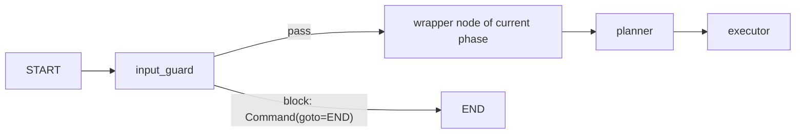

# ADR-0057 — The input guard is a node at the front of the parent graph

Status: ACCEPTED (founder, 2026-09-28 — fail closed) · Requirements: T71, T72 · Supersedes: business R9

## Context

A Belt or team member can type, or upload, text meant to steer the coach: ignore instructions,
reveal the prompt, fill fields without the Belt, reach other cases. Agent Improve runs inside the
intranet with read-only tools, so the damage is limited, but the coach's output feeds approved
records. Agent Flow will have tools with external effects, where this becomes a major risk.

The first model that reads the Belt's words is the planner's sufficiency judgment, which runs
before the executor. Middleware only wraps the executor's agent.

## Decision

1. A node `input_guard` runs in the parent graph, before routing to the current phase, on every
   turn that carries Belt text.
2. It checks in two steps: fixed rules first (length, encodings, known attack patterns), then Azure
   AI Content Safety Prompt Shields (user-prompt attack) over a private endpoint.
3. Pass → the turn continues unchanged. Block → `Command(goto=END)` with a plain refusal that tells
   the Belt what to do; nothing is written to `artifacts`, `field_status` or the Store; the verdict
   goes to `step_log`.
4. If Prompt Shields is unreachable the guard **fails closed** for that turn: the fixed rules still
   run, and the Belt is told the check is unavailable. (Open: fail closed vs open — founder.)
5. Uploads are screened in the upload pipeline (T72) with Prompt Shields' document-attack check
   before interpretation, and their text always reaches a model as labelled data.
6. Tool trust (T74) stays in middleware on the executor (`wrap_tool_call`), because it is per tool
   call; for Agent Flow, external-effect tools use human approval.

## Wiring

| Piece | Where |
|---|---|
| Node | `core/guard.py::input_guard`, added in `core/graph.py` between `START` and the phase routing |
| Fixed rules | `core/guard.py` constants |
| Prompt Shields client | `core/content_safety.py`, settings from config (endpoint, key), private endpoint only |
| Upload screening | `upload/agent.py`, before interpretation |
| Verdict record | `step_log` entry `{layer: "input_guard", status, reason, service}` |
| Resume turns | `Command(resume=…)` from `POST /gate/decision` carries no Belt text and skips the guard |

## Consequences

- One extra classifier call per turn (not a model call; outside T69's budget); latency to measure
  against R13.
- Prompt Shields' support for German must be tested before relying on it.
- ARCHITECTURE.md §2.3, §3.1, §3.2 and §2.1 change in the commit that builds the node.

## Rejected

- Middleware before the model call: runs on every model call and retry, and never sees the
  planner's judgment call.
- Screening inside the planner: mixes routing with security; the planner would already have read
  the text.
- `HumanInTheLoopMiddleware`: approves tool calls, not input.
